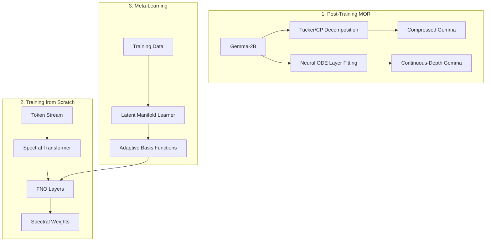

# Spectral/Continuous LLM Research Implementation Plan

## 1. Analysis & Findings

-   **Research Context**: The "curse of dimensionality" in LLMs is currently
    addressed via brute-force scaling or simple quantization. This plan proposes
    leveraging **Spectral Methods** and **Model Order Reduction (MOR)** to
    impose higher-order structure on the parameter space.

-   **Key Files**:
    -   `google3/third_party/google_research/google_research/gemma`: Reference
        implementation for Gemma.
    -   `google3/robotics/learning/mars/modules/node/`: Internal references for
        Neural ODEs.
    -   `google3/fitbit/research/foundation_models/wearable_health_interface/modeling/standard_components/neural_operators/`:
        Reference for Fourier Neural Operators (FNO).

-   **Design Patterns**:
    -   **Tucker/CP Decomposition**: Representing weight tensors as separable
        rank-1 products.
    -   **Neural ODEs**: Treating layer transitions as continuous flows (Euler
        discretization).
    -   **Resolution Invariance**: Using spectral operators that are agnostic
        to input grid size (sequence length).

## 2. System Architecture Diagram

## 3. Duckie Feedback Summary

-   **Advice (Technical Debt)**: Avoid custom CUDA kernels for spectral
    transforms initially; use `jax.numpy.fft` or `torch.fft` for portability and
    optimization. Ensure ODE solvers use adaptive step sizes (e.g., Dopri5) to
    prevent instability during long-sequence inference.

-   **Advice (Libraries)**: Prioritize `third_party/py/tensorly` for Tucker
    decomposition. For JAX-based FNO experiments, reference
    `third_party/py/neuralgcm` for spectral coordinate handling.

## 4. Step-by-Step Implementation

### Phase 1: Pre-Flight & Environment Setup

1.  **Status**: Verify clean state in `spectral-llm` project directory.

2.  **Environment**: Ensure JAX and PyTorch are available with FFT support.

### Phase 2: Post-Training MOR (PoC)

#### Task 1: Proper Generalized Decomposition (Implementer)

-   **Target**: `/opt/Workspace/slipbox/inbox/agents/spectral-llm/mor/pgd_enrichment.py`
-   **Audit**: Analyze Gemma-2B layer weights. Understand the objective function for refitting.

1.  **RED**: Write test ensuring that a **Greedy Enrichment** process can find a separable approximation of a 4D tensor that satisfies a target residual.

2.  **GREEN**: Implement the PGD algorithm:
    -   Define a separated representation $\sum_{m=1}^M \prod_{j=1}^d f_j^m(x_j)$.
    -   Implement the iterative enrichment loop to solve for factors $f_j^m$.
    -   Apply this to "refit" the Gemma weight tensors.

3.  **Verification**: Measure the residual error and the number of enrichment steps needed to reach parity with the original model.

#### Task 2: Continuous Flow Fitting (Implementer)

-   **Target**: `/opt/Workspace/slipbox/inbox/agents/spectral-llm/mor/ode_flow.py`

1.  **RED**: Write test verifying that an ODE solver can approximate the output
    of 4 Transformer layers given their input.

2.  **GREEN**: Implement a Neural ODE block using an Euler or RK4 solver to
    replace a subset of Gemma layers.

3.  **Verification**: Measure perplexity on WikiText-103 slice.

### Phase 3: Training from Scratch

#### Task 3: Spectral Transformer / FNO (Implementer)

-   **Target**:
    `/opt/Workspace/slipbox/inbox/agents/spectral-llm/scratch/fno_transformer.py`

1.  **RED**: Test that `FNOBlock` output is consistent (up to interpolation)
    when sequence length is doubled.

2.  **GREEN**: Implement a Transformer variant where the MLP or Attention is
    replaced by a Fourier Neural Operator.

3.  **Verification**: Train on `TinyStories` and verify perplexity < baseline
    after 1000 steps.

### Phase 4: Meta-Learning the Latent Manifold

#### Task 4: Adaptive Basis Learning (Implementer)

-   **Target**:
    `/opt/Workspace/slipbox/inbox/agents/spectral-llm/meta/basis_learner.py`

1.  **RED**: Test that learned basis functions are orthogonal and minimize
    residual on a toy dynamic system.

2.  **GREEN**: Implement a meta-learner that adjusts spectral basis coefficients
    based on input batch statistics.

3.  **Verification**: Compare convergence speed vs. fixed Fourier basis.

## 5. Verification & Validation

-   **Metrics**:
    -   **Compression Ratio**: Target > 4x reduction in total parameters.
    -   **Perplexity Delta**: Target < +0.5 perplexity points on standard
        benchmarks.
    -   **Invariance**: Verify FNO model performance remains stable across
        sequence lengths 512 to 2048.

-   **Rollout**: Experimental models to be evaluated using
    `google3/third_party/google_research/google_research/gemma` evaluation
    scripts.

-   **Cleanup**: Flush all temporary weight checkpoints after validation.
